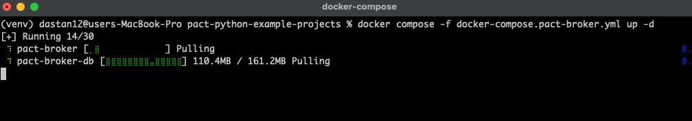

# Pact Broker Simple GET Example

This package is a copy of `simple_get_example` adapted to show how a consumer and provider share contracts through
Pact Broker.

It uses separate Participant names so it appears independently in the broker:

- Consumer: `GettingStartedBrokerOrderWeb`
- Provider: `GettingStartedBrokerOrderApi`

## What Changes With A Broker

Without a broker, the provider test reads the pact JSON file from the local `pacts/` directory. For a simple learning 
example this is fine. However, in production-ish setups this is impractical because the consumer and provider are often 
in different repositories or even different companies and the provider has no access to the consumer's source code.

With a broker, the workflow becomes:

1. The consumer test generates a pact JSON file.
2. The consumer publishes that pact to Pact Broker with a consumer version and branch.
3. The provider test retrieves the pact from Pact Broker.
4. The provider verifies the pact against the real provider API.
5. The provider can publish the verification result back to Pact Broker with a provider version and branch.

## Start Pact Broker

From the repository root:

```bash
# Start Docker Desktop first if the Docker daemon is not already running.
docker compose -f docker-compose.pact-broker.yml up -d
```
You should see that docker is pulling images -- if you are running it for the first time
 


The broker UI is available at `http://localhost:9292`.

The compose file intentionally sets the broker's advertised base URL to
`http://localhost:9292`. The Pact CLI commands in this example run from the host
machine, so the browser, generated broker links, and CLI all use the same URL.

If you change the compose file after the broker has already started, recreate
the broker container so the environment variable is applied:

```bash
docker compose -f docker-compose.pact-broker.yml up -d --force-recreate
```

## Generate The Consumer Pact

```bash
python3 -m pytest simple_get_broker_example/consumer -q
```

This writes:

```text
simple_get_broker_example/pacts/GettingStartedBrokerOrderWeb-GettingStartedBrokerOrderApi.json
```

## Publish The Pact

Install the Pact unified CLI on your host machine if `pact` is not already on
your PATH:

```bash
brew tap pact-foundation/tap
brew install pact-foundation/tap/pact
pact --help
```

If you are not using Homebrew, install with Pact's official script:

```bash
curl -fsSL https://raw.githubusercontent.com/pact-foundation/pact-cli/main/install.sh | sh
```

Use the host Pact CLI to publish the generated pact to your local broker:

```bash
pact broker publish simple_get_broker_example/pacts \
  --consumer-app-version 1.0.0 \
  --branch main \
  --broker-base-url http://localhost:9292
```

## Verify From A Broker Pact URL

Now the provider reads one exact pact (contract file) from the broker URL.

```bash
PACT_URL=http://localhost:9292/pacts/provider/GettingStartedBrokerOrderApi/consumer/GettingStartedBrokerOrderWeb/latest \
  python3 -m pytest simple_get_broker_example/provider -q
```

## Verify Through Broker Integration

This is the more realistic provider-side flow. Pact-python asks the broker for the latest `main` branch consumer pact,
verifies it, and publishes the provider verification result during the same test run when `PACT_PROVIDER_VERSION` is set.

```bash
PACT_BROKER_BASE_URL=http://localhost:9292 \
PACT_PROVIDER_VERSION=1.0.0 \
  python3 -m pytest simple_get_broker_example/provider -q
```

The two provider commands above are alternatives. There is no separate "publish provider results" CLI command here
because the provider verifier owns that result: it knows which pact was verified, which provider version passed or
failed, and uploads that result back to the broker as part of verification.

Stop the broker when you are done:

```bash
docker compose -f docker-compose.pact-broker.yml down
```
